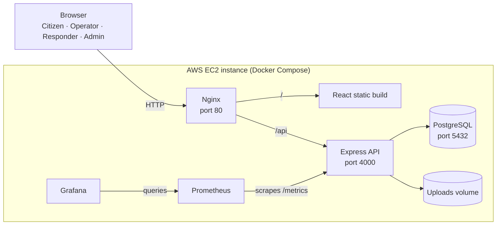
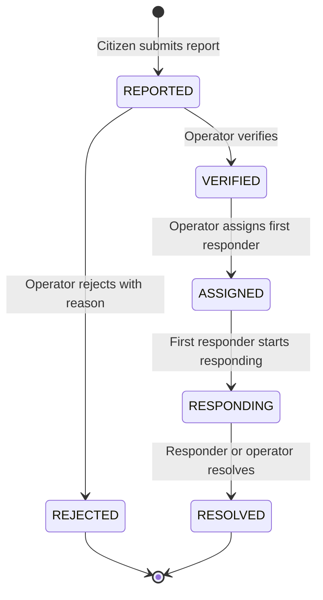
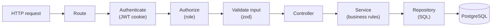
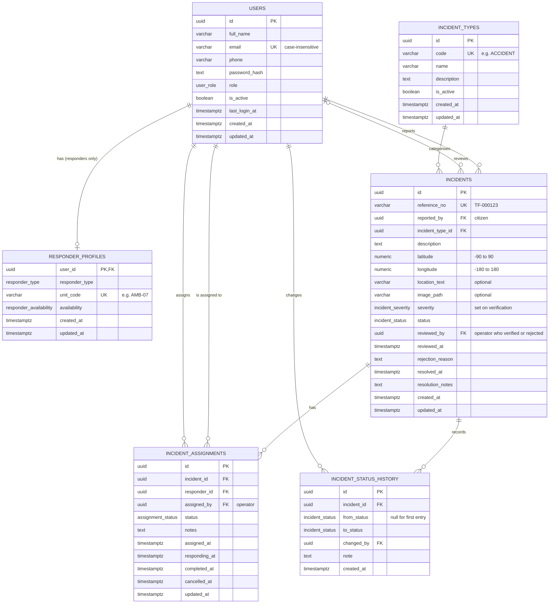
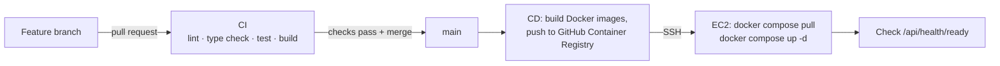

# TrafficFlow Architecture

> **Status:** the application is implemented: database (section 7), backend (section 6) and frontend (section 5), covering phases 0, 1 and 3–8. CI, containers, deployment and metrics (sections 10–11) are still the planned design. This is a living document: each phase updates the sections it touches.

## Contents

1. [System overview](#1-system-overview)
2. [Key decisions](#2-key-decisions)
3. [Roles and permissions](#3-roles-and-permissions)
4. [Incident lifecycle](#4-incident-lifecycle)
5. [Frontend](#5-frontend)
6. [Backend](#6-backend)
7. [Database](#7-database)
8. [Security](#8-security)
9. [Configuration](#9-configuration)
10. [Observability](#10-observability)
11. [DevOps pipeline and deployment](#11-devops-pipeline-and-deployment)

---

## 1. System overview

TrafficFlow is a React single-page application that talks to an Express REST API backed by PostgreSQL. In production every service runs as a Docker container on a single AWS EC2 instance.

Nginx is the only public entry point. It serves the built frontend and forwards API requests to the backend, so the browser only ever talks to one origin.



| Component | Responsibility |
|---|---|
| Nginx | Public entry point. Serves the React build and proxies `/api` to the backend |
| Frontend | React SPA with a separate portal for each role |
| Backend | REST API: authentication, authorisation, incident lifecycle, statistics, file uploads, metrics |
| PostgreSQL | System of record: users, incidents, assignments, status history |
| Prometheus | Collects backend metrics every 15 seconds and stores them as time series |
| Grafana | Dashboards built on Prometheus data. Only administrators can reach it |

The frontend and backend are independent applications. Each has its own `package.json`, Dockerfile and CI job, and they communicate only through the REST API.

---

## 2. Key decisions

| # | Decision | Choice | Reason |
|---|---|---|---|
| D1 | Repository layout | One repository with separate `frontend/` and `backend/` apps | One place to review and demo; the two apps stay independent |
| D2 | Backend structure | Feature modules, each split into routes → controller → service → repository | Related code stays together; HTTP, business rules and SQL are kept apart and are easy to test |
| D3 | Database access | Plain SQL with the `pg` driver and parameterised queries | The SQL is visible and easy to explain; no generated client or ORM engine to manage |
| D4 | Schema changes | Numbered SQL migration files in `database/migrations/` | The schema is versioned in Git alongside the code and can be rebuilt from scratch |
| D5 | Identifiers | UUID primary keys, plus readable incident references (`TF-000123`) | IDs in URLs can't be guessed; citizens get a short reference to quote |
| D6 | Location data | Latitude/longitude columns, no PostGIS | Map markers only need two numbers; PostGIS can be added later for spatial queries |
| D7 | Responders per incident | Many, through `incident_assignments` | Serious incidents need several services; reassignment history is kept |
| D8 | Authentication | JWT stored in an `httpOnly` cookie; bcrypt password hashes | Page scripts can't read the token, so an XSS bug can't steal it |
| D9 | Single origin | Nginx in production and the Vite proxy in development put the UI and `/api` on one origin | No CORS setup to get wrong, and auth cookies work without extra configuration |
| D10 | Frontend state | React Context for the logged-in user; no Redux | Almost all other state is server data loaded on demand |
| D11 | Live updates | Polling about every 20 seconds | Far simpler to build, containerise and proxy than WebSockets; good enough for this use |
| D12 | Image storage | Folder on disk (a Docker volume in production), served only through `GET /api/v1/incidents/:id/image` after the same access check as the incident | Free and simple on one instance; photos of accidents stay private; Amazon S3 is the natural upgrade |
| D13 | Deleting users | Deactivate (`is_active = false`), never delete | Incidents and history reference users; deleting them would break the audit trail |
| D14 | Branching | GitHub Flow with Conventional Commits | `main` always matches what is deployed; the history is readable |
| D15 | Test runner | Vitest for both frontend and backend | One tool with native TypeScript support |
| D16 | Module system | Native ES modules, TypeScript `NodeNext` resolution | The same standard as the frontend; relative imports name the compiled `.js` file |
| D17 | Health endpoints | `/api/health` (liveness) and `/api/health/ready` (readiness), outside `/api/v1` and not rate limited | Infrastructure depends on them; liveness never checks the database, so a database outage can't cause restart loops |
| D18 | Password hashing library | `bcryptjs`: the bcrypt algorithm in pure JavaScript | No native compilation to fail on Windows, in Docker images or in CI |
| D19 | Responder availability | Set automatically: `BUSY` when assigned, `AVAILABLE` when all their assignments end; responders go on or off duty themselves | Operators always see who can be sent without anyone updating it by hand |

---

## 3. Roles and permissions

| Action | Citizen | Operator | Responder | Admin |
|---|:-:|:-:|:-:|:-:|
| Register an account | ✓ | | | |
| Report an incident | ✓ | | | |
| View and track own incidents | ✓ | | | |
| View all incidents (list and map) | | ✓ | | ✓ |
| Verify or reject incidents | | ✓ | | |
| Assign and reassign responders | | ✓ | | |
| View assigned incidents | | | ✓ | |
| Update own response status | | | ✓ | |
| Mark an incident resolved | | ✓ (override) | ✓ | |
| Dashboard statistics | | ✓ | | ✓ |
| Manage users and responders | | | | ✓ |
| Manage incident types | | | | ✓ |

- **The backend enforces every permission on every request.** The frontend hides pages a role can't use, but that is for usability only.
- **Self-registration always creates a `CITIZEN`,** whatever the request contains. Operators, responders and admins are created by an admin.
- **The first admin is created by a seed script** from the `ADMIN_EMAIL` and `ADMIN_PASSWORD` environment variables. No credentials are hardcoded.
- **Admins can see all incidents but don't take part in the operational flow,** which keeps the roles clearly separated.

---

## 4. Incident lifecycle



| From | To | Who | Condition |
|---|---|---|---|
| (new) | `REPORTED` | Citizen | Report submitted |
| `REPORTED` | `VERIFIED` | Operator | Severity is set |
| `REPORTED` | `REJECTED` | Operator | A rejection reason is required |
| `VERIFIED` | `ASSIGNED` | Operator | First responder assigned |
| `ASSIGNED` | `RESPONDING` | Assigned responder | First responder marks their assignment as responding |
| `RESPONDING` | `RESOLVED` | Responding responder, or operator as override | All open assignments are closed |

### Rules

1. **Status only moves forward.** `REJECTED` and `RESOLVED` are final.
2. **Every change is recorded.** Each change writes a row to `incident_status_history` (who, when, from, to, note) in the same database transaction as the change itself.
3. **Invalid changes are refused** with `409 Conflict` and the error code `INVALID_STATUS_TRANSITION`.
4. **The rules live in one module** (`backend/src/modules/incidents/lifecycle.ts`) and have unit tests.

### Multiple responders

Each responder assigned to an incident gets their own row in `incident_assignments`, which has its own status:

```
ASSIGNED ──► RESPONDING ──► COMPLETED
    │
    └──► CANCELLED
```

- Operators can assign responders once an incident is `VERIFIED`, and can add more while it is `ASSIGNED` or `RESPONDING`.
- The first assignment moves the incident from `VERIFIED` to `ASSIGNED`.
- The first responder to start responding moves the incident from `ASSIGNED` to `RESPONDING`.
- When the incident is resolved, every open assignment becomes `COMPLETED`.
- Operators can cancel an assignment that hasn't started responding, for example to reassign it. They can't cancel the last open assignment, so the replacement must be added first. This keeps the incident lifecycle moving forward only.

---

## 5. Frontend

*Implemented. How to run it: [frontend/README.md](../frontend/README.md).*

### Structure

The code is organised by feature, not by file type:

```
frontend/src/
├── api/            # Axios client (client.ts) and one function per endpoint (endpoints.ts)
├── components/ui/  # Button, form fields, badges, cards, modal, pagination, icons
├── features/
│   ├── auth/       # AuthContext, useAuth, LoginPage, RegisterPage
│   ├── incidents/  # Used by several roles: maps, IncidentDetails, StatusTimeline, AssignmentList, IncidentCard
│   ├── citizen/    # MyIncidentsPage, ReportIncidentPage, CitizenIncidentPage
│   ├── operator/   # DashboardPage, charts, IncidentQueuePage, IncidentReviewPage, ReviewActions, MapViewPage
│   ├── responder/  # AssignmentsPage, ResponderIncidentPage
│   └── admin/      # SystemOverviewPage, UsersPage, UserFormModal, RespondersPage, IncidentTypesPage
├── hooks/          # useAsync: loading, errors and polling
├── layouts/        # AuthLayout, AppLayout (the sidebar changes per role), Logo
├── routes/         # RequireAuth, RequireRole, GuestOnly
├── types/          # Types for the API's data
├── utils/          # Labels, status colours, formatting
├── App.tsx         # All routes
└── main.tsx
```

### Routes

| Path | Access | Page |
|---|---|---|
| `/login`, `/register` | Public | Sign in, citizen registration |
| `/citizen` | Citizen | My incidents |
| `/citizen/report` | Citizen | Report an incident |
| `/citizen/incidents/:id` | Citizen | Incident detail and status timeline |
| `/operator` | Operator | Dashboard statistics |
| `/operator/incidents` | Operator | Incident queue, filtered by status and type |
| `/operator/incidents/:id` | Operator | Review, verify or reject, assign responders |
| `/operator/map` | Operator | Active incidents on a map |
| `/responder` | Responder | My assignments |
| `/responder/incidents/:id` | Responder | Incident detail, directions, start responding, resolve |
| `/admin` | Admin | System overview |
| `/admin/incidents`, `/admin/incidents/:id`, `/admin/map` | Admin | Incidents and live map (read-only) |
| `/admin/users` | Admin | Manage users |
| `/admin/responders` | Admin | Manage responder profiles |
| `/admin/incident-types` | Admin | Manage incident types |

After logging in, users are sent to their role's home page. `RequireRole` stops users from opening another role's pages.

### Design notes

- **API access:** one Axios instance with the base URL `/api/v1` sends the auth cookie. If a response is `401 Unauthorized`, it sends the user back to the login page.
- **Maps:** the app uses `react-leaflet` with OpenStreetMap tiles.
  - Citizens choose a location by clicking the map or using "use my location" (browser geolocation).
  - Operators see incidents as markers coloured by status.
  - Responders see their incident plus a directions link.
- **Polling:** dashboards, queues and tracking pages refresh about every 20 seconds.
- **Configuration:** `VITE_*` variables are built into the public JavaScript bundle, so they only hold non-secret settings such as the default map centre.

---

## 6. Backend

*Implemented. How to run it: [backend/README.md](../backend/README.md).*

### Structure

Items marked *(later)* don't exist yet.

```
backend/
├── src/
│   ├── config/         # env.ts: checks every setting at startup
│   ├── db/             # pool.ts, transaction.ts, migrate.ts (migration runner), errors.ts
│   ├── modules/
│   │   ├── health/     # liveness and readiness endpoints
│   │   ├── auth/       # register, login, logout, current user; tokens.ts, passwords.ts
│   │   ├── users/      # admin user management
│   │   ├── responders/ # responder profiles, availability, own assignments
│   │   ├── incidentTypes/ # incident types
│   │   ├── incidents/  # routes, controller, service, repository, schemas, lifecycle.ts
│   │   └── stats/      # dashboard and system statistics
│   ├── middleware/     # requestLogger, rateLimiter, authenticate, authorize, validate, upload, notFound, errorHandler
│   ├── metrics/        # (later) Prometheus registry and custom metrics
│   ├── scripts/        # migrate.ts and seed.ts (npm run db:migrate / db:seed)
│   ├── types/          # domain.ts (roles, statuses …), express.d.ts (req.user)
│   ├── utils/          # logger, AppError, pagination, imageType, http helpers
│   ├── app.ts          # Builds the Express app without starting it (used by tests)
│   └── server.ts       # Starts the HTTP server and shuts down cleanly on SIGTERM
├── tests/              # Unit tests; tests/integration/ runs against PostgreSQL
├── .env.example
├── Dockerfile          # (later)
├── package.json
├── tsconfig.json       # Type checking for src and tests
└── tsconfig.build.json # Production build: src only, into dist/
```

### Middleware order

Every request passes through the middleware in `app.ts` in this order:

1. **Request logger:** gives the request an ID and logs it when it finishes
2. **Helmet:** security headers
3. **JSON body parser:** reads JSON bodies up to 100 kB
4. **Health routes** at `/api/health`: not rate limited
5. **Rate limiter**, then the versioned API router at `/api/v1`. Inside it, each module's routes run authenticate → authorize → validate → controller
6. **Not found:** no route matched, respond 404
7. **Error handler:** turns any error into the standard error response

### Request flow



| Layer | Responsibility | Must not |
|---|---|---|
| Route | Map a URL and method to middleware and a controller | Contain logic |
| Controller | Read the request, call a service, send the response | Run SQL or apply business rules |
| Service | Business rules: permissions on data, lifecycle transitions, transactions | Know about HTTP request or response objects |
| Repository | Parameterised SQL queries | Contain business rules |

### Cross-cutting concerns

- **Errors:** services throw typed `AppError`s, and one error handler turns them into this response format:

  ```json
  { "error": { "code": "INVALID_STATUS_TRANSITION", "message": "Cannot move incident from REPORTED to RESOLVED", "requestId": "0b6f4c1e-…" } }
  ```

  Unexpected errors are logged in full but reach the client only as a generic `500 INTERNAL_ERROR`. Stack traces are never returned. The full list of error codes is in [backend/README.md](../backend/README.md#errors).
- **Validation:** `zod` checks the environment variables at startup, and every request body, query string and path parameter before it reaches a controller. Invalid input returns `400 VALIDATION_ERROR` with one message per field. Authentication and role checks run first, so anonymous users learn nothing about an endpoint's input.
- **Logging:** `pino` writes structured JSON logs, one line per request, which you can read with `docker logs`.
- **Request IDs:** every request gets an ID, taken from a valid incoming `X-Request-Id` header or newly generated. It appears in every log line for that request, in the `X-Request-Id` response header and in error responses.
- **Rate limiting:** each client IP may make 1000 requests per 15 minutes to `/api/v1`, and 10 *failed* login or registration attempts. Successful logins don't count, so normal use is never blocked. Both limits are configurable.
- **Pagination:** list endpoints accept `?page=` and `?limit=` (maximum 100).
- **Graceful shutdown:** on `SIGTERM` (sent by `docker stop`) the server stops accepting connections, finishes the requests in progress, and closes the database pool.

### API

All endpoints are under `/api/v1` unless stated otherwise, and all are implemented except `/metrics`. Request and response details are in [backend/README.md](../backend/README.md#api).

| Method | Path | Access | Purpose |
|---|---|---|---|
| GET | `/` (that is, `/api/v1`) | Public | API information: name and version |
| POST | `/auth/register` | Public | Create a citizen account and log in |
| POST | `/auth/login` | Public | Log in and receive the session cookie |
| POST | `/auth/logout` | Public | Clear the session cookie |
| GET | `/auth/me` | Logged in | Current user |
| GET | `/incident-types` | Logged in | Active incident types for the report form |
| POST | `/incidents` | Citizen | Report an incident (multipart form, optional image) |
| GET | `/incidents/mine` | Citizen | Own incidents |
| GET | `/incidents` | Operator, Admin | All incidents, filtered by status, type, severity, date and search text |
| GET | `/incidents/map` | Operator, Admin | Open incidents for the map |
| GET | `/incidents/:id` | Owner, Operator, assigned Responder, Admin | Incident detail with its assignments and status timeline |
| GET | `/incidents/:id/image` | Same as above | The incident's photo |
| PATCH | `/incidents/:id/verify` | Operator | `REPORTED → VERIFIED`, sets severity |
| PATCH | `/incidents/:id/reject` | Operator | `REPORTED → REJECTED`, reason required |
| POST | `/incidents/:id/assignments` | Operator | Assign one or more responders |
| PATCH | `/incidents/:id/assignments/:assignmentId/cancel` | Operator | Cancel an assignment that hasn't started |
| PATCH | `/incidents/:id/resolve` | Responding Responder, Operator | `RESPONDING → RESOLVED` |
| GET | `/responders` | Operator, Admin | Responders, filtered by type and availability |
| GET | `/responder/me` | Responder | Own profile and availability |
| PATCH | `/responder/me/availability` | Responder | Go on duty or off duty |
| GET | `/responder/assignments` | Responder | Own assignments (active or finished) |
| PATCH | `/responder/assignments/:id/respond` | Responder | Start responding (`ASSIGNED → RESPONDING` for the incident if first) |
| GET | `/stats/dashboard` | Operator, Admin | Operational statistics |
| GET | `/stats/system` | Admin | System-wide statistics |
| GET, POST | `/admin/users` | Admin | List and create users of any role |
| GET, PATCH | `/admin/users/:id` | Admin | View and change a user: name, phone, role, active state, password |
| PATCH | `/admin/responders/:id` | Admin | Change a responder's type, unit code or availability |
| GET, POST | `/admin/incident-types` | Admin | List all types; create a type |
| PATCH | `/admin/incident-types/:id` | Admin | Rename, describe, activate or deactivate a type |
| GET | `/api/health` | Public | Liveness: the process is up |
| GET | `/api/health/ready` | Public | Readiness: PostgreSQL answers |
| GET | `/metrics` | Internal only | Prometheus metrics (Phase 10) |

### Testing

Tests build the real app with `createApp()` and send HTTP requests to it with `supertest`; no server port is opened.

- **Unit tests** (no database) cover:
  - configuration and the lifecycle rules
  - validation schemas
  - access control without a session, and forged or expired tokens
  - the health endpoints, including failing, slow and shutting-down dependencies
  - error handling, security headers, request IDs and rate limiting
  - utilities
- **Integration tests** (`tests/integration/`) run the whole API against a real PostgreSQL database: registration and login, reporting with a photo, verification, assigning several responders, responding, cancelling, resolving, every business rule, statistics and administration. They run when `TEST_DATABASE_URL` is set: locally, or with a PostgreSQL service container in CI.

---

## 7. Database

*Implemented. Details and commands: [database/README.md](../database/README.md).*

### Conventions

- Table names are plural and `snake_case`.
- Every primary key is a `UUID` generated by `gen_random_uuid()` (built into PostgreSQL 13 and later).
- Timestamps are `TIMESTAMPTZ`, stored in UTC and shown in local time by the frontend.
- Tables whose rows change have `created_at` and `updated_at`. A trigger keeps `updated_at` current.
- Fixed sets of values use PostgreSQL `ENUM` types. The one list admins can edit (`incident_types`) is a normal table.
- Incident references look like `TF-000123`: `TF-` followed by a number from a database sequence, padded to at least six digits. The sequence keeps references unique even when many reports arrive at once. A failed insert can leave a gap in the numbers, which is expected and harmless.

### Entity relationship diagram



### Enum types

| Type | Values |
|---|---|
| `user_role` | `CITIZEN`, `OPERATOR`, `RESPONDER`, `ADMIN` |
| `incident_status` | `REPORTED`, `VERIFIED`, `REJECTED`, `ASSIGNED`, `RESPONDING`, `RESOLVED` |
| `incident_severity` | `LOW`, `MEDIUM`, `HIGH`, `CRITICAL` |
| `assignment_status` | `ASSIGNED`, `RESPONDING`, `COMPLETED`, `CANCELLED` |
| `responder_type` | `POLICE`, `AMBULANCE`, `FIRE`, `TOW`, `ROAD_MAINTENANCE` |
| `responder_availability` | `AVAILABLE`, `BUSY`, `OFF_DUTY` |

### Relationships

| Relationship | Cardinality | Meaning |
|---|---|---|
| `users` → `responder_profiles` | 1 to 0..1 | Only users with the `RESPONDER` role have a profile |
| `users` → `incidents.reported_by` | 1 to many | A citizen reports many incidents |
| `users` → `incidents.reviewed_by` | 1 to many (optional) | An operator verifies or rejects many incidents |
| `incident_types` → `incidents` | 1 to many | Every incident has one type |
| `incidents` ↔ `users` (responders) | many to many | Linked through `incident_assignments`, which also records the assigning operator |
| `incidents` → `incident_status_history` | 1 to many | The full timeline of each incident |

### Integrity rules

- **Deleting users:** foreign keys that point to `users` use `ON DELETE RESTRICT`, so a user with history can't be deleted, only deactivated.
- **Deleting incidents:** `incident_assignments` and `incident_status_history` use `ON DELETE CASCADE`, so an incident's rows are removed with it.
- **Coordinates:** `CHECK` constraints keep `latitude` between −90 and 90 and `longitude` between −180 and 180, stored as `NUMERIC(9,6)`.
- **Rejections:** a `CHECK` constraint requires `rejection_reason` when `status = 'REJECTED'`.
- **No duplicate assignments:** a partial unique index on `incident_assignments (incident_id, responder_id)` where the status is `ASSIGNED` or `RESPONDING` stops a responder from being actively assigned twice to the same incident.
- **Case-insensitive email:** a unique index on `LOWER(email)` means `A@x.com` and `a@x.com` can't both register.
- **Rules the database can't check:** for example, "a responder profile belongs to a `RESPONDER` user". The service layer enforces these.

### Indexes

| Table | Index | Supports |
|---|---|---|
| `users` | `LOWER(email)` unique, `role` | Login, filtering by role |
| `incidents` | `status`, `reported_by`, `incident_type_id`, `created_at DESC` | Operator queue, "my incidents", statistics |
| `incident_assignments` | `(responder_id, status)`, `incident_id` | "My assignments", incident detail |
| `incident_status_history` | `(incident_id, created_at)` | Status timeline |

### Migrations and seed data

```
database/
├── migrations/   # 001_create_enums.sql, 002_create_users.sql … applied in order
├── seeds/        # demo-data.json: demo accounts and incidents around Colombo
└── README.md     # How to run migrations and seeds
```

- A migration script (`npm run db:migrate`) applies pending files in order. Each file runs in its own transaction and is recorded in a `schema_migrations` table.
- **Never edit a migration that has been merged.** Change the schema by adding a new migration.
- Reference data the app needs to work, such as the default incident types, is created by migrations. Demo data lives in `seeds/demo-data.json`. The seed script (`npm run db:seed -- --demo`) creates the demo incidents through the backend's incident service, so they follow the lifecycle rules and get proper history.
- A PostgreSQL advisory lock stops two processes from running migrations at the same time.
- The first admin account is seeded from environment variables.
- Statistics are calculated with SQL queries (counts by status and type, average time to resolve), not stored in separate tables that could fall out of date.

---

## 8. Security

| Area | Measure |
|---|---|
| Passwords | Hashed with bcrypt (`bcryptjs`, cost factor 12). Never logged or returned by the API. A failed login takes the same time whether or not the email exists |
| Sessions | JWT signed with `JWT_SECRET`, sent as an `httpOnly`, `SameSite=Lax` cookie; the `Secure` flag is on when the site is served over HTTPS |
| Authorisation | Role checks on every protected route; data rules (for example "only your own incidents") in the service layer |
| Registration | Always creates a `CITIZEN`; privileged roles are created only by an admin |
| SQL injection | Only parameterised queries (`$1`, `$2` …); user input is never joined into SQL strings |
| Input | Every request is checked with `zod`; unknown fields are removed |
| HTTP headers | `helmet` sets security headers |
| Brute force | At most 10 failed login or registration attempts per IP per 15 minutes |
| File uploads | JPEG, PNG and WebP only, maximum 5 MB, stored under random file names (the uploaded file name is never used). The file's first bytes are checked, so a script renamed to `.jpg` is rejected. Photos are served only after the same access check as their incident |
| Secrets | Environment variables only; `.env` files are ignored by Git; CI/CD secrets are kept in GitHub Actions secrets |
| Exposure | Only Nginx is public; PostgreSQL, Prometheus, Grafana and `/metrics` are not reachable from the internet |
| Errors | Production error responses never include stack traces or SQL |

---

## 9. Configuration

*Backend and frontend variables are implemented (`backend/src/config/env.ts`, `backend/.env.example`, `frontend/.env.example`). The PostgreSQL and Grafana container variables arrive with Docker in Phase 9.*

| Variable | Used by | Secret | Example / notes |
|---|---|:-:|---|
| `NODE_ENV` | Backend | | `development`, `test` or `production` |
| `PORT` | Backend | | `4000` |
| `LOG_LEVEL` | Backend | | `info` |
| `TRUST_PROXY` | Backend | | `0` locally, `1` behind Nginx, so the real client IP is used |
| `RATE_LIMIT_WINDOW_MS` | Backend | | `900000` (15 minutes) |
| `RATE_LIMIT_MAX` | Backend | | `1000` requests per client IP per window on `/api/v1` |
| `AUTH_RATE_LIMIT_MAX` | Backend | | `10` failed logins per client IP per window |
| `APP_VERSION` | Backend | | `dev` locally; the deployment pipeline sets the Git commit SHA |
| `DATABASE_URL` | Backend | ✓ | `postgres://<user>:<password>@db:5432/trafficflow` |
| `JWT_SECRET` | Backend | ✓ | Long random string (at least 32 characters) |
| `JWT_EXPIRES_IN` | Backend | | `8h` |
| `COOKIE_SECURE` | Backend | | `true` only when the site is served over HTTPS |
| `UPLOAD_DIR` | Backend | | `uploads` |
| `MAX_UPLOAD_SIZE_MB` | Backend | | `5` |
| `BCRYPT_ROUNDS` | Backend | | `12` |
| `DATABASE_POOL_MAX` | Backend | | `10` |
| `ADMIN_NAME`, `ADMIN_EMAIL`, `ADMIN_PASSWORD` | Seed script | ✓ (password) | First admin account |
| `DEMO_USER_PASSWORD` | Seed script (`--demo`) | ✓ | Password for every demo account |
| `TEST_DATABASE_URL` | Integration tests | ✓ | A disposable database whose name contains `test`; wiped by the tests |
| `POSTGRES_DB`, `POSTGRES_USER`, `POSTGRES_PASSWORD` | PostgreSQL container | ✓ (password) | Database created on first start |
| `GF_SECURITY_ADMIN_USER`, `GF_SECURITY_ADMIN_PASSWORD` | Grafana container | ✓ (password) | Grafana login |
| `VITE_MAP_DEFAULT_LAT`, `VITE_MAP_DEFAULT_LNG`, `VITE_MAP_DEFAULT_ZOOM` | Frontend build | Public | `6.9271`, `79.8612`, `12` (Colombo) |

- Real values go in `.env` files, both locally and on the server. These files are never committed.
- Committed `.env.example` files contain placeholders only.
- The backend checks every variable at startup and exits with a clear message if a required one is missing or invalid.

---

## 10. Observability

*Logs, request IDs and health checks are implemented (Phase 1). Metrics and dashboards are planned for Phase 10.*

- **Logs:** structured JSON from `pino`, collected by Docker (`docker compose logs backend`). Every line carries the service name, version and request ID. Authorization headers and cookies are always masked. Successful health checks aren't logged, so frequent polling doesn't flood the logs.
- **Health checks:**
  - `GET /api/health` (liveness) shows the process is running, with its version and uptime. It never checks external dependencies.
  - `GET /api/health/ready` (readiness) runs every registered dependency check in parallel, each with a 2-second timeout.
    - Returns `200 ready`, or `503 not_ready` with each check marked `up` or `down`.
    - Failure details go to the log only.
    - From Phase 3, the database check is registered in `server.ts`.
  - During shutdown, readiness returns `503 shutting_down`.
  - Docker health checks and the deployment pipeline both use these endpoints.
- **Metrics** (`GET /metrics`, collected by Prometheus):
  - Default Node.js process metrics: memory, CPU, event loop lag
  - `http_requests_total` by method, route and status code
  - `http_request_duration_seconds` histogram by method and route
  - `trafficflow_incidents_reported_total` by incident type
  - `trafficflow_incidents_open` by status
- **Dashboards:** Grafana's data source and dashboards are set up from files in `docker/grafana/` (dashboards as code), so they appear automatically on a fresh deployment.

---

## 11. DevOps pipeline and deployment

*Planned for Phases 2, 9 and 11.*



### Continuous integration (Phase 2)

- Runs on every pull request to `main` and on every push to `main`.
- **Backend job:** install → lint → type check → test (against a PostgreSQL service container) → build.
- **Frontend job** (from Phase 7): install → lint → type check → test → build.
- npm dependencies are cached between runs.
- Branch protection on `main` requires these checks to pass before a pull request can be merged.

### Containers (Phase 9)

| Image | Built from |
|---|---|
| Backend | Two stages: compile TypeScript, then a small Node.js runtime image that runs as a non-root user |
| Frontend | Two stages: Vite build, then `nginx:alpine` serving the static files and proxying `/api` |
| PostgreSQL, Prometheus, Grafana | Official images with pinned versions |

- **Named volumes** hold the database data, uploaded images and Prometheus and Grafana data.
- **Health checks** make services wait for their dependencies. Migrations run before the API starts.
- **Configuration** lives in `docker/nginx/`, `docker/prometheus/` and `docker/grafana/`. Each app's `Dockerfile` sits in its own folder, and `docker-compose.yml` is at the repository root.

### Deployment (Phase 11)

1. A merge to `main` triggers the deployment workflow.
2. Images are built in GitHub Actions and pushed to GitHub Container Registry, tagged with the commit SHA.
3. The workflow connects to the EC2 instance over SSH, pulls the new images and restarts the stack with `docker compose up -d`.
4. It then calls `/api/health/ready`. If the check fails, the workflow fails.
5. **Rollback:** redeploy the previous commit's image tag.

**Server setup:**

- Ubuntu LTS with Docker Engine and the Compose plugin.
- The security group allows ports 80 and 443 from anywhere, and SSH (port 22) only from the developer's IP address.
- The production `.env` file exists only on the server.
- Images are built in CI, not on the server, because small instances (1 GB memory) can run out of memory during a frontend build.
